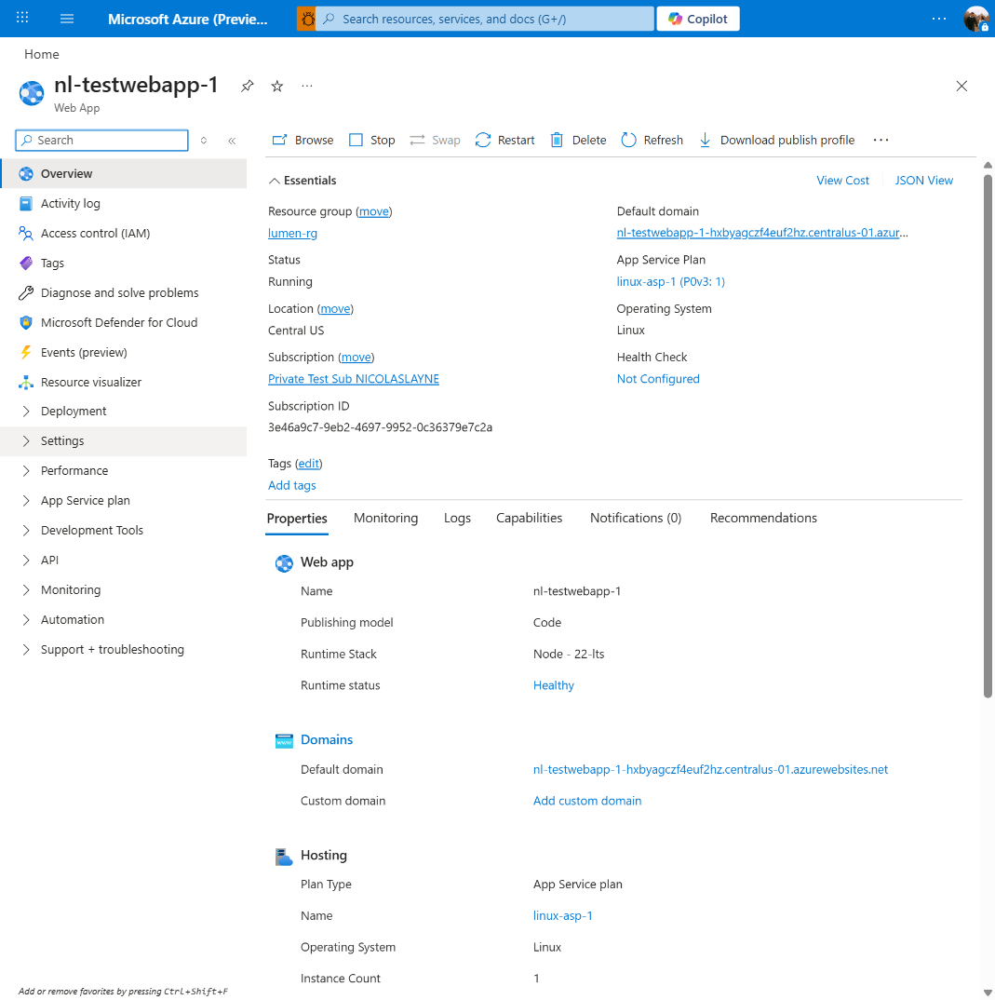
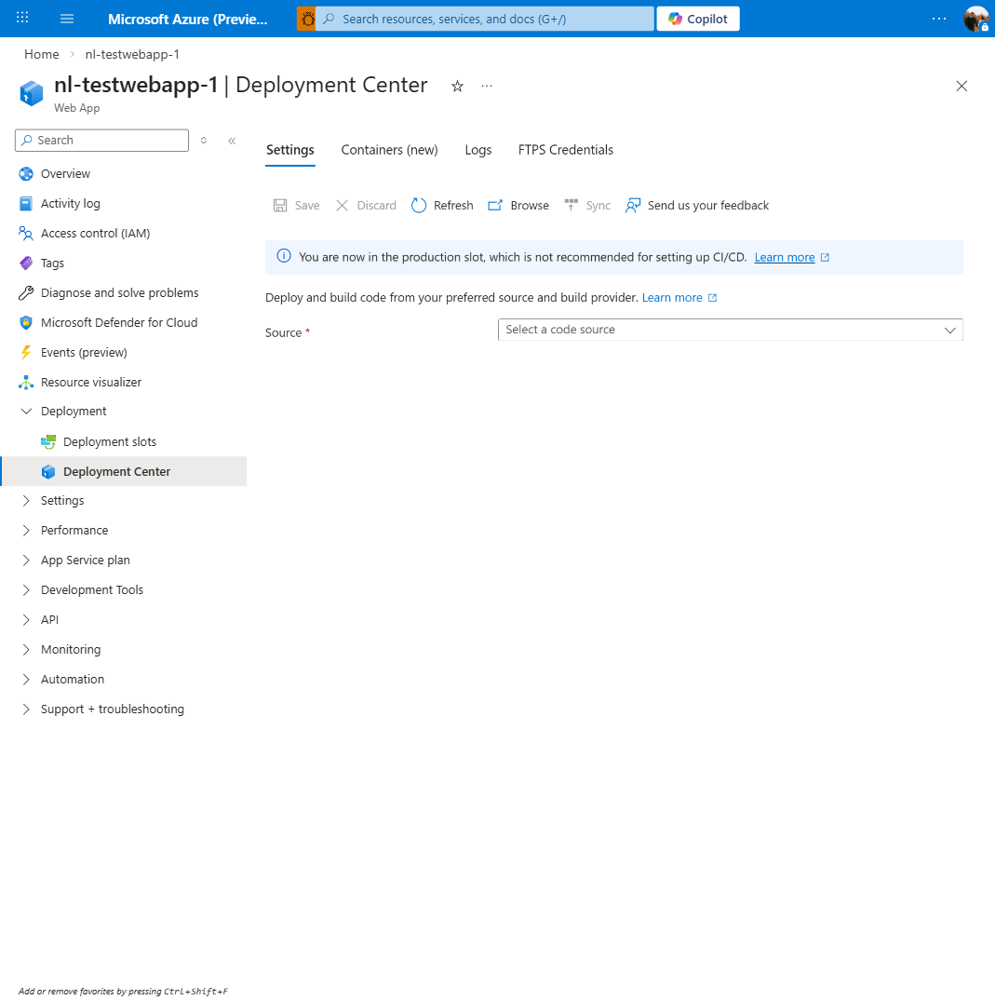
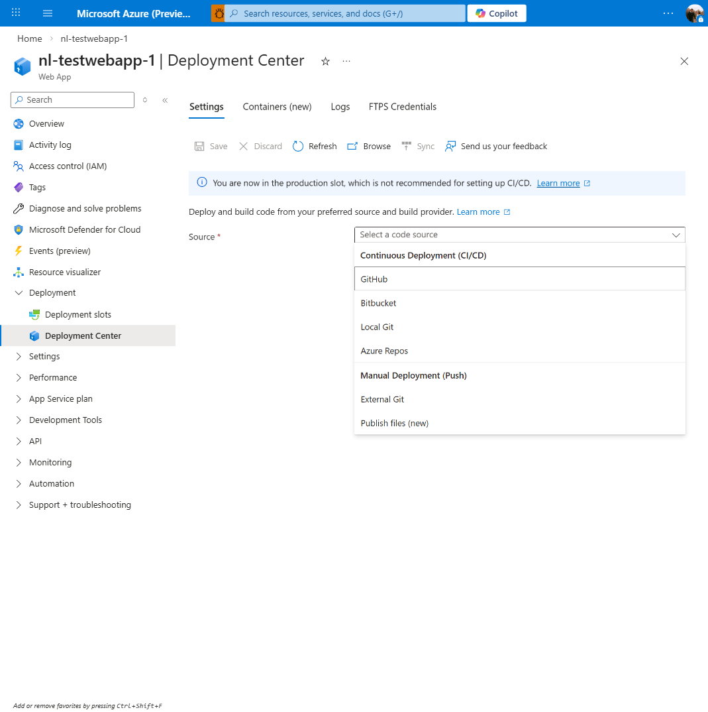
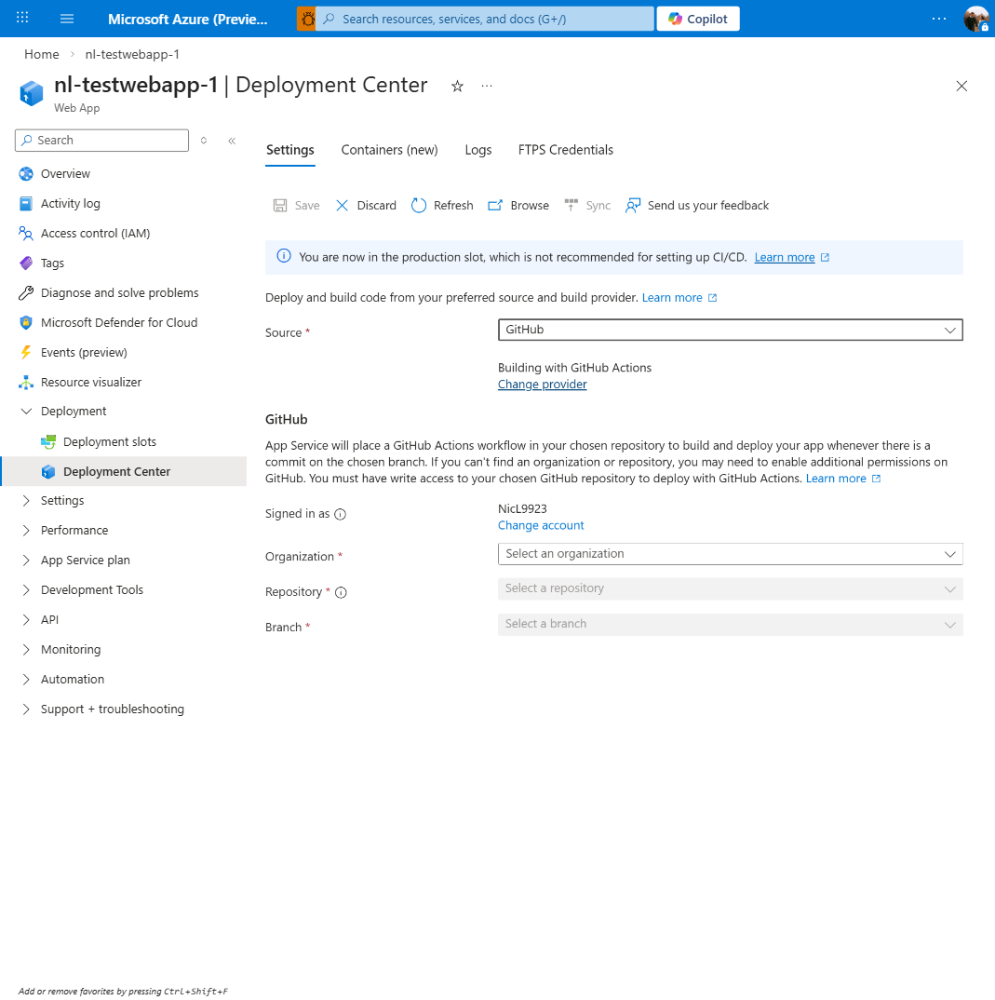
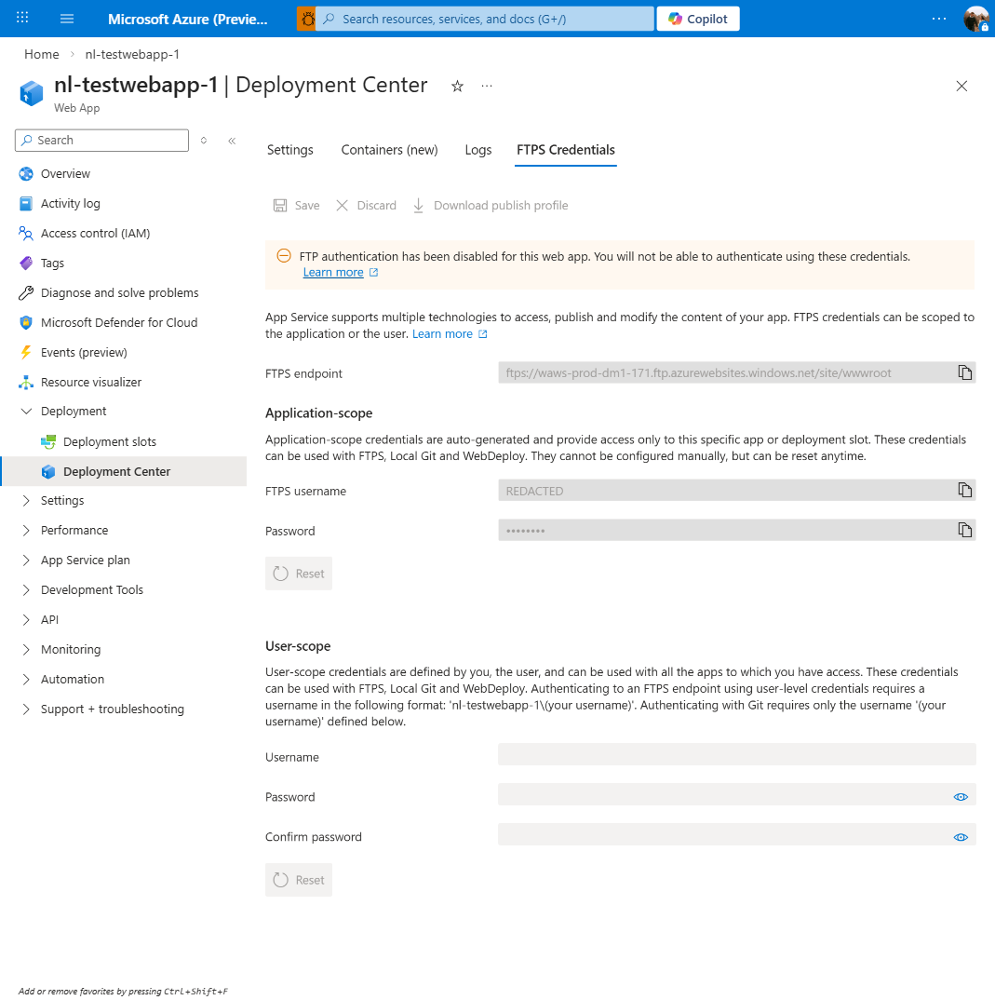
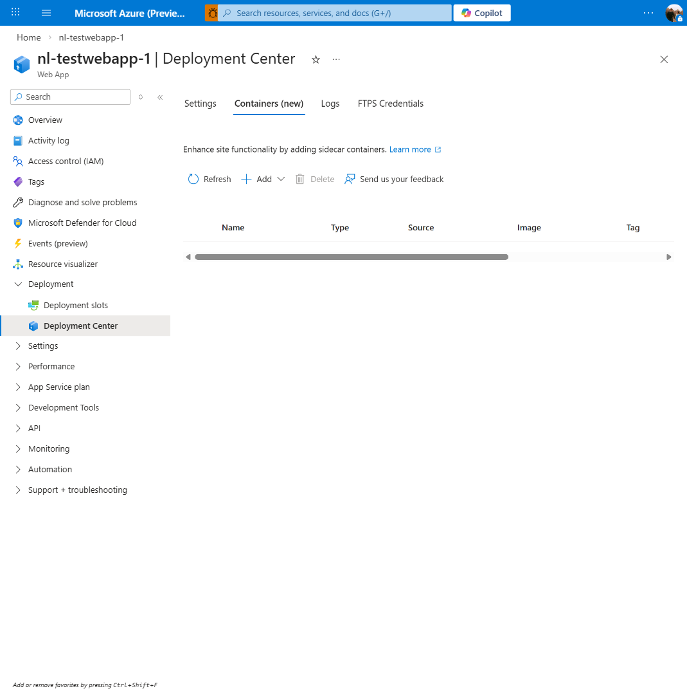
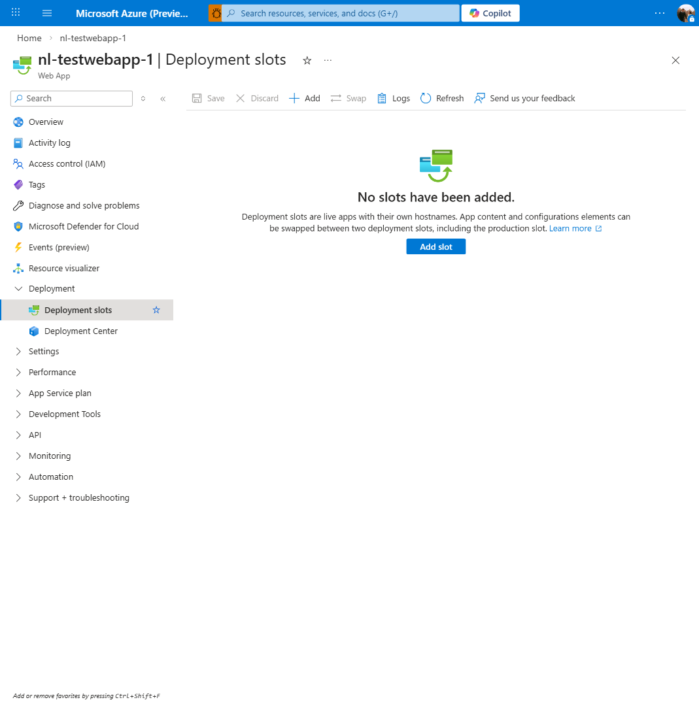

# Azure App Service — Build & Deployments UX Exploration

## Mission

Reimagine the **Build & Deployments** experience for Azure App Service in the Azure Portal. The current UX is functional but dated — it's cluttered, inconsistent, and doesn't reflect how modern developers think about CI/CD. We're building a proof-of-concept that demonstrates what a truly modern deployment management experience could look like.

## Goals

### 1. Deep Understanding of the Current Experience

Before we redesign anything, we need to understand _everything_ about how the current deployment UX works:

- **Deployment Center** — the main blade, its tabs (Settings, Logs, FTPS Credentials)
- **Source configuration** — GitHub, Azure DevOps, Bitbucket, Local Git, External Git, FTP
- **Build providers** — GitHub Actions, Azure Pipelines, App Service Build Service (Kudu/Oryx)
- **Deployment slots** — creation, swapping, traffic routing, slot settings
- **Monitoring** — deployment logs, log streaming, Kudu console
- **Edge cases** — container deployments, static content, Windows vs Linux differences
- **Manual methods** — ZIP deploy, Web Deploy, Run From Package, CLI workflows

We'll capture screenshots of every screen, flow, and state in the current portal and document them in `docs/screenshots/`.

### 2. Identify Pain Points & Opportunities

What's broken, confusing, or just _meh_ about the current UX:

- Where do users get lost?
- What workflows take too many clicks?
- What information is buried or missing?
- Where is the UX inconsistent with itself or with other Azure services?
- What modern CI/CD patterns (GitHub-first, preview environments, deploy previews) are completely absent?

### 3. Design a Modernized Experience

Build a POC that demonstrates:

- **Clean, opinionated defaults** — GitHub Actions as the primary CI/CD path, with others as alternatives
- **Real-time deployment status** — live build/deploy progress, not "check logs"
- **Slot management that makes sense** — visual slot comparison, one-click swap with diff preview
- **Deployment history that's actually useful** — who deployed what, when, from which commit, with rollback
- **Modern patterns** — preview environments per PR, deploy protection rules, deployment approvals
- **Progressive disclosure** — simple for simple apps, powerful for complex ones

### 4. Mock the Surrounding Portal Chrome

To make the POC feel real, we'll mock the Azure Portal shell (navigation, breadcrumbs, resource header) so stakeholders can evaluate the UX in context.

---

## Constraints

### Frontend-Only — No Backend Changes

This POC is strictly a **UX-layer redesign**. We are not changing, replacing, or extending any backend APIs, ARM resources, or platform behavior. The existing App Service deployment infrastructure stays exactly as-is. We're reshaping how users _interact_ with it, not how it _works_.

### All Mock Data — No Real Backend

This POC uses **dummy/mock data throughout**. No real API calls, no real Azure resources, no real GitHub connections. Every screen and scenario should be clickable with realistic-looking fake data so we can demo every flow end-to-end without any actual configuration.

### Two Design Variants

We'll build **two versions** of the deployment experience:

1. **Bold** — A completely revamped experience. Throw out the current layout assumptions. Reimagine what deployment management looks like if we started from scratch with modern UX patterns. This is the "what if" vision.

2. **Safe** — A more conservative evolution. Keeps the familiar structure and patterns that current portal users expect, but modernizes the visuals, improves information hierarchy, and fixes the most painful UX issues. This is the "we could actually ship this" version.

Both variants share the same portal chrome mock and mock data layer. The toggle between them should be easy (e.g., a switcher in the UI).

### Full Feature Parity — Nothing Gets Dropped

Every deployment method that exists today **must remain accessible** in the redesigned experience. We can (and should) reorganize, re-prioritize, and improve discoverability, but we cannot remove functionality. Concretely:

- **Modern/popular options** (GitHub Actions, Azure Pipelines) → promoted, first-class flows
- **Legacy/niche options** (FTP, External Git, Local Git, OneDrive) → still accessible, just not front-and-center
- **All configuration knobs** → still reachable, possibly through progressive disclosure or "Advanced" sections

Think of it as **editorial curation, not feature removal**. A user deploying via FTP should still be able to do so — they just won't see FTP competing for attention alongside GitHub Actions on the landing screen.

---

## Approach

1. **Screenshot & document** the current portal experience (all deployment-related blades)
2. **Research** every deployment option, API, and configuration (see `docs/azure-app-service-deployments.md`)
3. **Identify** UX pain points and map user journeys
4. **Sketch** new UX concepts (wireframes → high-fi mockups in code)
5. **Build** the POC iteratively in this repo using React + TypeScript
6. **Iterate** based on feedback

## Repo Structure

```
aas-deployments-poc/
├── docs/
│   ├── exploration.md              # This file — goals, approach, findings
│   ├── agent-thoughts.md           # Sol's analysis and recommendations
│   ├── azure-app-service-deployments.md  # Deep-dive reference on AAS deployments
│   └── screenshots/                # Current portal screenshots for reference
├── src/                            # React app — the POC
│   ├── components/                 # UI components
│   ├── mock-data/                  # Fake data for the POC
│   └── ...
└── ...
```

---

## Current Experience Analysis

> Screenshots captured 2026-03-19 from `nl-testwebapp-1` (Linux, Node 22-LTS, Code publishing model).

### Web App Overview



**Context:** Resource header + Essentials panel + tabbed Properties view. Left nav organizes blades into collapsible sections. The **Deployment** section contains two items: Deployment slots and Deployment Center. Toolbar includes Browse, Stop, Swap, Restart, Delete, Refresh, Download publish profile.

**Notes:**
- The Overview blade itself shows deployment-relevant info (Runtime Stack, Publishing model) but no deployment _status_ — you'd never know if a deploy is in progress or just failed from this screen.
- "Download publish profile" is in the Overview toolbar but the credentials are in Deployment Center > FTPS Credentials. Split personality.

---

### Deployment Center — Settings Tab (Unconfigured)



**Tabs:** Settings | Containers (new) | Logs | FTPS Credentials

**Toolbar:** Save, Discard, Refresh, Browse, Sync, Send us your feedback

**Key elements:**
- Info banner: "You are now in the production slot, which is not recommended for setting up CI/CD."
- Instructional text: "Deploy and build code from your preferred source and build provider."
- Single dropdown: **Source** → "Select a code source"

---

### Source Dropdown Options



Two groups in a flat `<select>`:

**Continuous Deployment (CI/CD):**
- GitHub
- Bitbucket
- Local Git
- Azure Repos

**Manual Deployment (Push):**
- External Git
- Publish files (new)

**Observations:**
- Just bold text headers in a dropdown — no icons, no descriptions, no visual hierarchy
- GitHub and External Git get identical visual weight
- No indication of which option is most common or recommended
- "Publish files (new)" is intriguing — appears to be a newer addition
- Missing: ZIP Deploy, Web Deploy, Run From Package aren't here (they're CLI/API-only methods)

---

### GitHub Source Selected



**What appears when GitHub is selected:**
- "Building with GitHub Actions" label with tiny "Change provider" link
- Large explanatory paragraph about how GitHub Actions workflow files work
- **Signed in as:** NicL9923 / "Change account"
- Cascading dropdowns: Organization → Repository → Branch (each disabled until previous is filled)

**Observations:**
- The "Change provider" link is easy to miss — it controls whether you use GitHub Actions vs. Kudu, which is a significant choice buried in a tiny link
- Walls of explanatory text that power users skip and beginners still find confusing
- The cascading dropdown pattern means 3 sequential interactions minimum — no search, no autocomplete, no "paste a repo URL"
- Huge empty space below the form — the page doesn't adapt to content

---

### Deployment Center — Logs Tab


**Empty state:** "CI/CD is not configured. To start, go to Settings tab and set up CI/CD."

**Table columns:** Time | Deployment ID | Author | Status | Message

**Toolbar:** Refresh, Delete

**Observations:**
- Plain flat table with no filtering, sorting indicators, or expandable rows
- No timeline view, no visual status indicators (color-coded badges, etc.)
- "Deployment ID" is a raw ID — not human-friendly
- No way to see build logs inline — you'd need to click through
- The empty state links back to Settings, which is good

---

### Deployment Center — FTPS Credentials Tab



**Sections:**
1. **FTPS endpoint** — copy-able URL
2. **Application-scope** — auto-generated username/password with Reset button
3. **User-scope** — user-defined username/password/confirm with Reset button

**Banner:** "FTP authentication has been disabled for this web app."

**Observations:**
- This is a legacy/advanced feature that most users never touch
- Having its own top-level tab feels like over-promotion
- The "disabled" banner + showing credentials anyway is confusing UX
- Toolbar includes "Download publish profile" — redundant with Overview toolbar

---

### Deployment Center — Containers (new) Tab



**Purpose:** Sidecar container management (not the main app container).

**Table columns:** Name | Type | Source | Image | Tag

**Toolbar:** Refresh, Add (dropdown), Delete, Send us your feedback

**Observations:**
- This is for sidecar containers, not the primary deployment method
- Empty scrollbar visible on an empty table (minor polish issue)
- The "(new)" label in the tab name signals this is a recent addition
- Separate from the main deployment flow — makes sense to keep distinct

---

### Deployment Slots Blade



**Empty state:** Centered illustration + "No slots have been added." + "Add slot" CTA button

**Toolbar:** Save, Discard, Add, Swap, Logs, Refresh, Send us your feedback

**Observations:**
- Clean empty state — one of the better empty states in the portal actually
- "Swap" button visible even with no slots (should be disabled/hidden?)
- This is a separate blade from Deployment Center — slots and deployments are managed in different places
- No visual representation of the production ↔ staging relationship

---

## Pain Points & Opportunities

| # | Area | Pain Point | Opportunity |
|---|------|-----------|-------------|
| 1 | Source selection | Flat dropdown treats all 6 sources equally | Card-based selection with GitHub promoted; progressive disclosure for legacy options |
| 2 | Build provider | "Change provider" is a tiny, easily-missed link | Make build provider selection explicit and visual, not hidden |
| 3 | GitHub flow | 3 cascading dropdowns, no search/autocomplete | Repo URL paste support, search-as-you-type, remember recent repos |
| 4 | Deployment status | Overview blade shows zero deployment info | Add deployment status badge/card to Overview |
| 5 | Logs | Plain table, no inline log viewing, no filters | Timeline view, expandable rows with inline logs, status badges |
| 6 | FTPS Credentials | Own top-level tab for a rarely-used feature | Move to Settings > Advanced or a collapsible section |
| 7 | Slots + Deployments | Managed in separate blades, no visual connection | Integrate slot awareness into deployment view (deploy to which slot?) |
| 8 | Information density | Walls of explanatory text, huge empty areas | Contextual tooltips, inline help, better use of space |
| 9 | Slot swapping | No visual diff, just a confirmation modal | Visual comparison of slot configurations before swap |
| 10 | Real-time feedback | No live build/deploy progress anywhere | Streaming build logs, deploy progress indicator |

---

## Design Concepts

_To be populated as we iterate on the POC._
